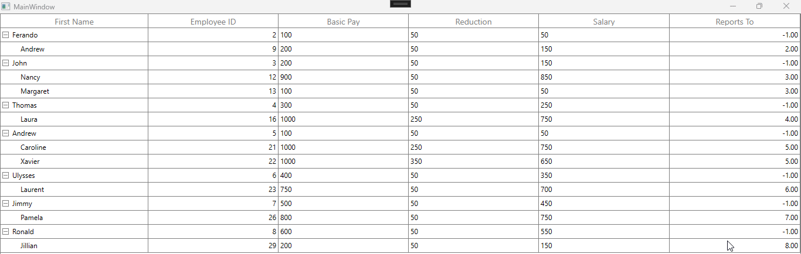

In [WPF TreeGrid](https://www.syncfusion.com/wpf-controls/treegrid) (SfTreeGrid), it is possible to change the value in one column based on the value edited in another column by utilizing the `CurrentCellValidated` event. This event allows you to access the current cell's row data and update the necessary column value based on specific conditions.

**Step 1:** **Subscribe to the CurrentCellValidated Event**: In the constructor of your main window, subscribe to the `CurrentCellValidated` event of the TreeGrid.
 
 ```csharp
public MainWindow()
{
    InitializeComponent();
    this.treeGrid.CurrentCellValidated += TreeGrid_CurrentCellValidated;
} 
 ```
 **Step 2:** **Handle the Event**: In the event handler, check if the edited column is one of the columns you want to monitor (e.g., "BasicPay" or "Reduction"). If so, retrieve the relevant data and update the target column accordingly.
```csharp
private void TreeGrid_CurrentCellValidated(object sender, TreeGridCurrentCellValidatedEventArgs e)
{
    if (e.RowData != null && (e.Column.MappingName == "BasicPay" || e.Column.MappingName == "Reduction"))
    {
        var reduction = (e.RowData as EmployeeInfo).Reduction;
        var basicPay = (e.RowData as EmployeeInfo).BasicPay;
        (e.RowData as EmployeeInfo).Salary = basicPay - reduction;
    }                        
} 
 ```
The above implementation will automatically update the `Salary` column whenever the `BasicPay` or `Reduction` columns are modified.

 
 
Take a moment to peruse the [WPF TreeGrid-Data Validation](https://help.syncfusion.com/wpf/treegrid/data-validation), to learn more about the Data Validation with examples.
